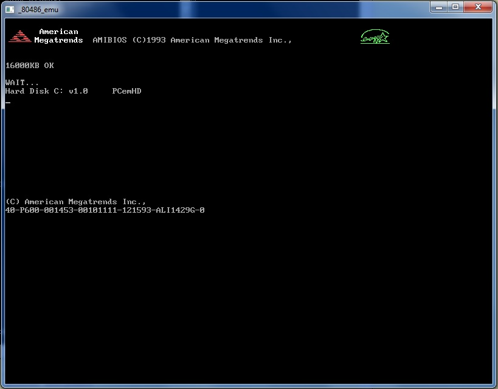

# PCEM_FB486
80486 emulator with SVGA in BASIC, by jepalza

From https://www.freebasic.net/forum/viewtopic.php?f=8&t=27435:

> Some time ago I raised a challenge: make a PC emulator 80486 in Basic !!!
> 
> To achieve this, I used a very old version of PCEM, with the help of "FreeBasic", starting from PCEM-V4.1, about six months ago, I managed to make it work, in 80286 mode only. Then I went little by little adding functionalities of the following versions, until arriving at the V8 (not completely, but if great part). Due to the complexity and lack of speed in BASIC, I have only converted the modules that have interested me the most, eliminating many unnecessary ones, so I have managed to reach an 80486-DX2-66mhz with FPU, 16mb of RAM and VGA TSENG of 2mb.
>
> I have removed many non-necessary modules, such as the sound (it does not have any sound), the LPT port, the PS2 port, the FDC unit and more.
>
> It has many faults, but in general they work VERY well, and it is capable of running "WINDOWS 3.11", "Deluxe Paint", "Wolfstein 3D" and many other programs.
>
> It can reach a resolution of 800x600 to 16 colors, but it moves better in 640x480 16 colors.
>
> The keyboard fails, all the keys do not work, and neither EMM386.EXE nor EXPANDED memory can be used, because it fails and becomes very slow.
>
> It works in both protected mode and real mode, but when entering protected mode, the PC becomes slow.
>
> Note: Keyboard cursors may be disabled the first time. Maybe when pressing "NumLock" they work again.
> 
> 
> 
> 
> 
> 
